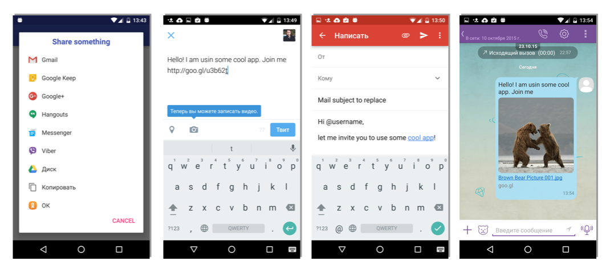

# CustomSharingDialog
A demo project for [blog post](http://drew-ousenko.xyz/sharing-on-android-different-actions-for-applications/)

Describes a way to show a custom sharing dialog with different sharing action for each application, e.g.:

- When chosen, Gmail and other mail apps will open compose message with custom subject and HTML-formatted body;
- When chosen, messenger-alike apps will open compose message Activity with a short message already pasted;
- etc.

